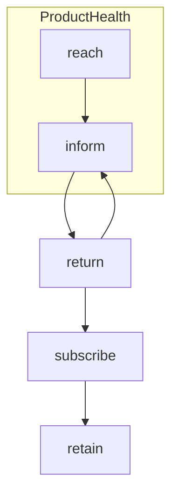

# Dayplan
## Tasks
### Overdue
```tasks
not done
due before 2021-12-20
```
### Due today
```tasks
not done
due on 2021-12-20
```
### Due in the next two weeks
```tasks
not done
due after 2021-12-20
due before {{date+14d:YYYY-MM-DD}}
```
### No due date
```tasks
not done
no due date
```
### Done today
```tasks
done on 2021-12-20
```
### Capture:
- [x] #task Finish Benefits Registration ⏫ 🛫 2021-12-20 ⏳ 2021-12-20 📅 2021-12-27 ✅ 2022-01-03
- [x] #task Update MTM priority overview doc ⏫ 🛫 2021-12-17 ⏳ 2021-12-17 📅 2021-12-20 ✅ 2022-01-26
- [x] #task Meet Lauren Amato (VP Ads) ✅ 2022-01-13
# Inquirer
## Reference Documents
## Meeting Notes
- ### [[Mark Loomis]] 1-on-1
#### [[Analytics Team]] 2022 Goalsetting
- background
	- tried to do okrs at [[Analytics Team]] level
		- never had company goals before 2021
	- 2021: had company plans & individual development plans
		- Challenge of OKR not meant for performance managmeent
		- Mark Would like to keep OKRs for quarterly work, but don't have "Result results" in a traditional way, but try to tie to things like retention improvement
		- #reflection Would it be worth bringing up OKRs as a [[Product, Design, and Engineering]] framework to [[Matt Boggie]]?
	- 2022 proposed:
		- Process?
			- Set themes for us (based on company prios):
			- let analysts talk to their stakeholders to get an understanding of theirs
			- We convene for OKR workshops; (come in with objective language, leave with objectives + draft KRs)
- [[Newsroom Indexes]]
	- supporting it will be a challenge
	- Was built to [[Patrick Kerkstra]]'s priorities
		- Potential DEI issues (which he's aware of)
	- Questions:
		- Do we want to use these going forward?
		- How do we long-term support and resource them as a team?
	- ###[[Bill Tevis]]
- Been prioritized enough to get business done, but not enough to do what's needed with the data
- People impacted:
	- Impacts bill and his 2 analysts (meghan agarn, bethony maddox) + finance: tracy (who used to be on his team), ryan cullins, Jeff coony (supports ops from finance)
	- Some folks on marketing team
	- Operations folks who use DSI data for reporting (jim gorman, kevin holmes, david vasquez)
- Tracy and Jim Anton both do keeping the lights on work
	- Special editions: tracy has to do manually every time it happens. She does it and to the org it works. $4m/yr
	- Individuals across the company that keep things running and it's not widely understood how much are on their shoulders.
- You can't hire Tracy. You can backfill an accountant.
	- She can't be taken from her role because of what she wants to do, but she wants to grow
	  
	  
	  Ad side:
- still learning the datasets
	- want to see the data in excel size; get grounded in there
	- Want to:
		- be able to viewthe entire ad-map on the site
		- Analyze rating on each of them
	- Tried:
		- downloading for each position for an entire day: how are we filling that position (programmatically, direxel) and see it as if it were a newspaper
		- Still too granular, but can't scale it
	- see a build of every ad unit that
### [[Newsroom Indexes]] Overview:
Background:
- Advanced analytics editorial data product, started in 2017, 2018
- Not being used overall; and patrick not encouraging people to use it
	- wasn't rolled out completely and especialy after The Uprising in 2020, became untennable to have 
	  
	  Key Questions:
- Will these be sustained and continue to be used?
	- [[Daniel McNichol]]'s take: needs more resourcing, engingeering, product develpmnent, roadmap
	  
	  History:
- had nothing in the analytics that the structure / nature of the newsroom was reflected
- Thede were developed as a management tool to help staff
	- gaps on teams heavy with freelancers (opinion, style)
	  
	  Structure:
- Weighted distillation of digital key metrics
	- Taken from baseline period of June 2018-July 2019
- Reporter, not topic based, then aggregated into Reporter -> team -> desk -> newsroom hierarchy
- Based on an American Press Institute tool, but had major setbacks (required lots of manual tagging, was relative to everything now, so couldn't be change over time)
- Built around the concepts of the Funnel (Reach, Depth, Retention, Production)
	-
		- ![[Pasted image 20211220144412.png]]
		- ![[Pasted image 20211220144502.png]]
- Usage of indexes in practice:
	- Resource allocation
	- informing investment and where we pull back
	- goalesetting (never used)
	- decisions into buyouts and layoffs
	- NOTE: everything that went into this needed to be cleared with the guild
		- e.g. individual reporters could only see their own pages
- Additional metrics:
	- % BIPOC: possible demographic attirbution proportionally via GeoIP
		- GeoIP -> ZIP -> census demographics
		- not very precise: some signal there, but needs more validation
			- when you start to look by topic area, there are empirically validating aspects to the methodology
- Attribution:
	- dayforce manager is better than what we have now
	- It would be better if there was a desk assignment in the CMS but that was never put in: "That would be great for analytics of all sorts. By the way the newsroom is structured, we can't show them metrics that reflect it, since that structure's not in the data"
	-
### [[julie westfall]]
- 2022
	- next steps for [[Newsletters]] platform
	- feeds for next year might finally get prioritized
	- prepping for reader experience handoff
	  
	  Newsletters:
- inkbox - newsletter tool
- 3 years to replatform to marketing cloud
	- INFINITEDLY WORSE than prior tool. couldn't be used by any newsroom employee
	- While working on revamping newsletter strategy as a company
	- Decided to build a tool somewhere between [[arc composer]] and marketing cloud
		- engineers loved it; not just hacking arc
		- had a platform called Ink for pushalerts via firebase
		- how to puersuade:
			- tested morning newsletter and 1-2 others with it and it was terrible
			- 2-3 month period with matt, getting stakeholders together to think through options, and what needs to be deferred to newsletter strategy to do this
- Obsessing with SEO did damage to news organazations
	- took responsibility of writing for people out of the loop
		- seo at best is writing for what people want
	- digital strategy being boiled down to pageviews, clicks, keywords
- insights partnering future:
	- want to get to a place where evaluating newsletter subproducts (and other types of products) on both agreed upon KPIs and ideas of what to look for in data based on org KPIs
	- When something isn't covered by regular check-ins, we can figure out together what needs to be assessed
## Reflections
### #kpi Financial Health vs Product Health
We need indicators of the health of the newspaper toward its long term goals. Examples of this could be reaching the audience of Philadelphians (not just “in-DMA”) or key marginalized community groups. Community vitality. Are we reaching and informing Philadelphians and are our efforts in one are helping or hurting us in this 

Reach -> Inform -> retain
Need to inform in order to subscribe 


- Product team might like that: they con't like the financial metrics, could a mission metric bring them closer to alignment with the financial health
	- **We need a mission metric: something that aligns with our core values of informing PA**
- Partners from lenfest:
	- Scott ...
	- Spotlight PA
		- chris something
		  
		  
		  [[Lindsay Grow]]: #orggoals [2022 PICK chart]([https://miro.com/app/board/o9J_lkg9p3U=/](https://miro.com/app/board/o9J_lkg9p3U=/))
# Home