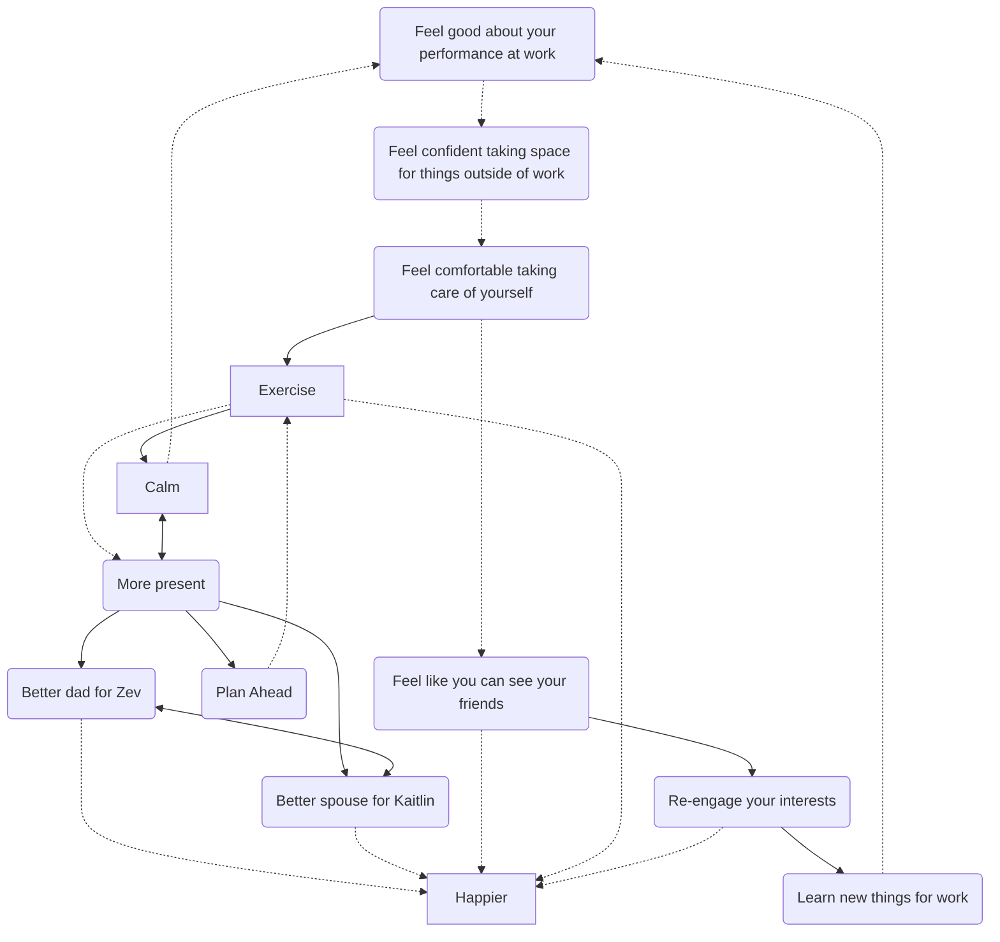

<< [[2022-02-22]] | [[2022-02-24]]>>

# 0. Dayplan
## 🌤 1. **FILL OUT** Morning Journal
### What are you grateful for?
Space to fafff around; but more so the sense of humility to recognize when I’ve been fucking up and can do better; so much better.

The humility to recover. To accelerate. To go beyond. To do more than enough for others, not just the bare minimum.
### What do you want today's highlight to be?
1. To create a product that enables others to do something with greater focus and clarity. To make paths easier. In this case, it means a work plan for the kickoff: how do we start to have the conversations that are needed.
2. That and to have digested my notes into an organized place so that they’re ready for tomorrow and my commitments can be followed up upon.
### What are today's mantras
- plan Ahead; don’t just look ahead. Anticipate and account. That way you’ll be ready.
### What's on your mind?

## 2. 🕶 **REVIEW** Your Priorities
![[2022-W09#Plans]]
### [[priority|Priority Project List]] 
![[priority]]
## 3. 📆 **CAPTURE** Plan for Today
### 4. PUT IT IN YOUR DAILY LOG AND MEETING LOG
# 📝 Tasks
## Tasks
#### Over Due

```tasks

not done

due before 2022-02-23

```
#### Due Today

```tasks

not done

due on 2022-02-23

```
#### New Today
- [ ]
# 📰 Meeting Log
### [[Newsroom]] Morning Meeting
- Chaired by [[Gabriel Escobar]] - Editor in Chief. Calls out each desk as they
- Starting with [[Ross Maghielse]] giving overview of homepage
	- In Morning Meeting, [[Ross Maghielse]] presents the homepage with a Chartbeat plugin showing aspects of performance
	- [[Molly Eichel]]: Ukraine/Russia Liveblog
		- "at the mercy of SEPTA"; septa's been closing platforms and doors, trapping various riders inside.
	- [[Cathy Rubin]] News desk:
		- Landmark voter registration policy to be passed tomorrow
		- Melanie to have Recall. Northern burlington regional district board member who won her election in 2020, because petition by 3 residents to oust her. Chancellor of UMass Amherst. Plan to go after her and every other school board member.
		- Moore College of arts and design to get new prsident. Boston Berklee Conservatory head.
		- Dancer and coreographer; embargoed for noon
	- [[Charlotte Sutton]]: Health
		- Eating Disorders and where to get health: followup to men and eating disorders from earlier this week
		- Fitness new writer: non-exercise core
	- Business:
		- CEO out at Spark Theraputics. Using gene therapy from Childrens Hospital of Philadelphia. Bought out for 5B
		- Penn budget group: most wage gains have been lost to inflation
	- Investigations: nothing today
	- Features [[Julie Busby]]:
		- Good Pizza: wharton student giving donations to a thing
		- James Beard Semi-Finalists to be announced today
			- Expecting some local chefs. Expecting some at least local ties
		- Shamir now based in Philadelphia. Participated in INQ live event last week
		- Look at Rhodan museum. Shut in january; now reopened. 15 sculptures of hands by rhodan
	- Service Desk [[Megan Griffith-Greene]]
		- Might be some service around early foter registration
		- Town guide to Aardmore
		- Might do a complete list of restaurants around james beard who have gbotten it recently
	- Sports [[John Roberts]]
		- 13 things to know about James Harden before his debut
		- Villanova's loss to Uconn
	- [[Rich Jones]] - Editorial?
		- Jersey mall cop arrests - most blatently racist thing I've seen in a long time
	- Graphics [[David Maialetti]]
		- Touring around city hall and septa to look for those closed gates
		- [[Gabriel Escobar]] Do we have a photo of the new president
	- There's a US trucker protest, slated to go to DC. Might go through scranton, harrisburg, we're close to DC. Getting inquiry on social.
		- found a bunch of facebook pages talking about supply lines. Talked to a convicted insurance fraud guy. Different facebook groups in different locations.
## [[Product, Design, and Engineering]] Leads
- Value for Google Workspace Enterprise:
	- We're grandfathered into classic Google Workspace; should we migrate to enterprise sooner?
		- BigQuery in Google Sheets
## data leads
- [ ] #task finish data strategy ⏫ 📅 2022-02-24
- [ ] #task Schedule workshop with matt for next week on strategy
- [ ] #task talk to matt about extra time for goals cascading from strategy for team
## [[Marketing]]
## [[Insights Guild]] research meeting
- Mara's contracts person: Mike Cruz - been here for 30 years. Sent her to Amanda Baker
# 📓Daily Log
## [[Hiring|hiring]]
- [x] Data engineer hiring -> hiring
- [ ] #task Write [Data Engineer JD](https://docs.google.com/document/d/157hyZdMTGoyEW0k9WBINtn3hKav807C72YzkDvFZsIc/edit) 🔼 🛫 2022-02-23 ⏳ 2022-02-23 📅 2022-02-25
- [ ] #task Write [Sr Analyst Job Description](https://docs.google.com/document/d/1tvFTY2KlSDk-NtYxcg-WwgZtorjmitDjkrv5Nfjau7s/edit) ⏫ 🛫 2022-02-23 ⏳ 2022-02-23 📅 2022-02-24
## [[Incident Management]]
## [[Insights Guild]]
# Reflection
# Daily Checklist:
## Start of Day
- [ ] Meditate
- [x] [[#0 Dayplan]]
- [x] Check Email
- [x] Check Slack
## End of Day:
- [x] Review TODOs and change any deadlines
- [ ] Create notes for Tomorrow of communications that need to go out
- [ ] Clear unused headings from log
- [ ] Write an end-of-day [[#Reflections|Reflection]]
## Other Tasks
#### No Due Date

```tasks

not done

no due date

```
#### Done Today

```tasks

done on 2022-02-23

```