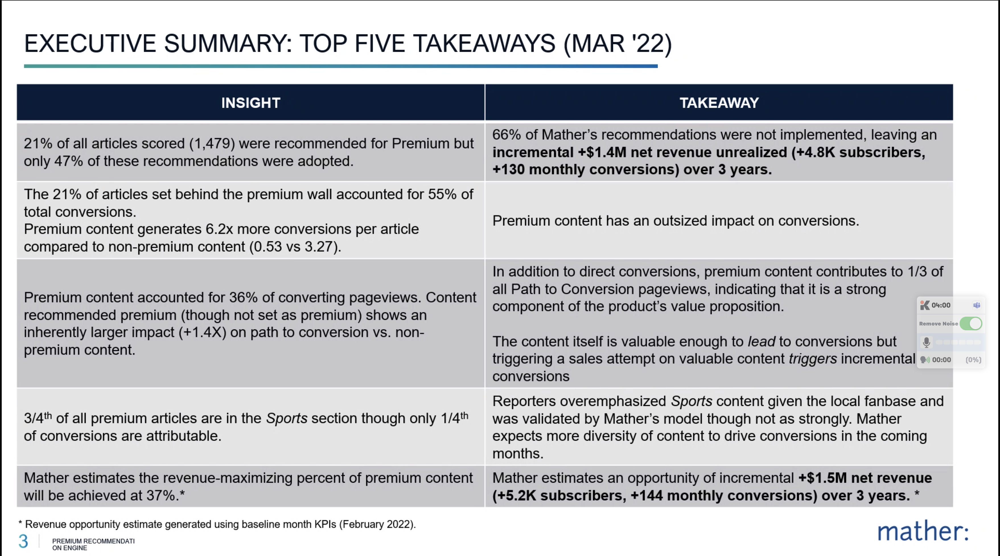
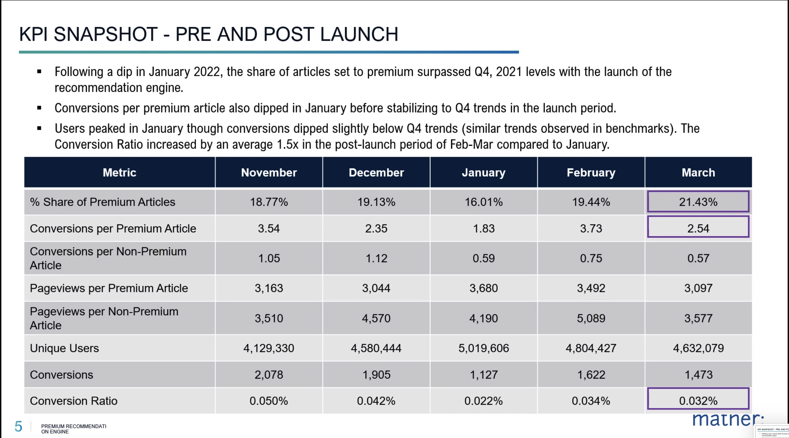
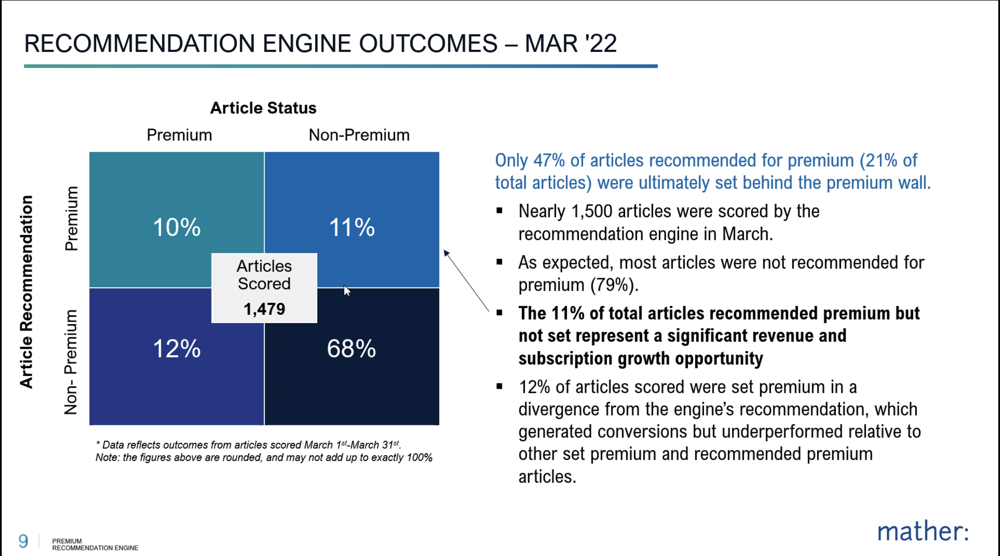

- Goals for the day:
	- Welcome [[Eva von Weltin]] and [[Aquil]]
	- NOW Finish your goals
	  :LOGBOOK:
	  CLOCK: [2022-04-04 Mon 13:29:46]
	  CLOCK: [2022-04-04 Mon 13:29:49]--[2022-04-04 Mon 13:29:55] =>  00:00:06
	  CLOCK: [2022-04-04 Mon 13:30:00]
	  :END:
	- NOW Have the week planned ahead
	  :LOGBOOK:
	  CLOCK: [2022-04-04 Mon 13:29:50]--[2022-04-04 Mon 13:29:51] =>  00:00:01
	  CLOCK: [2022-04-04 Mon 13:29:52]
	  :END:
	- NOW Have the week organized in terms of docs and plans
	  :LOGBOOK:
	  CLOCK: [2022-04-04 Mon 10:05:45]
	  CLOCK: [2022-04-04 Mon 10:05:49]
	  :END:
- Meetings:
	- #meeting/1:1
		- [[Rachelc]]
		  collapsed:: true
			- Marketing underserved needs:
				- Retention reporting: underserved for years
					- Must do onsite: Customer onboarding.
						- we do have a welcome journey: 4 emails sent out to new subscribers
						- No touchpoints onsite, nothing driving stickiness
					- [[Onboarding Journey]]:
						- 3 phases to user journey
							- Welcome: first 30 days post subscription
								- Digital, print, former digital/print subs get 8-10 emails over the course of a month showing benefits of subscriptions
								- Onsite touchpoints: Will be blueconic toasters for now; showing value
							- Nurture:
								- Reconnect using same vehicles (email, onsite, telesales, directmail, paid social) based on behavior
								- Personalizing (e.g. reading sports every day; not signed up for daily sports newsletters)
								- sending out comms that get them to read content they like onsite
								- "Subscriber Connections"
							- Reengagement: Dropout
								- Starting with Paid social: FB and Instagram
								- Working on email from Blueconic:
									- once there's a connection, will email based on engagement behavior
						- Going to need to figure out: 1. how to build, but 2: how to monitor
							- How to monitor [[Onboarding Journey]] will need to be set up with [[Analytics Team]]
							-
			-
		- #[[Mark Loomis]] #meeting/1:1
			- comms
			- [[Datadog]] - supposed to have a bunch of tests for us
	- [[Eva von Weltin]] and [[Aquil]] [[Data Engineering]] onboarding #meeting
		- "There's a lot of names; will I have to remember them all?"
	- [[Alexandra]] #meeting/1:1
	  collapsed:: true
		- Previously been on very reactive teams, taking work as it comes
		- First real set of goals
			- Previously did Q4 OKRs with [[inquirer/analytics]]
			- These goals are much more fitting
		- work at nonprofit: who was covered by what grant
			- Hadn't had coverage before of this data
		- Naviga work's been real reactive:
			- "Do you know why this is happening?" Research -> case
			- "Why's it there"
			- LATER Need to find an owner for [[Naviga]]. Not acceptable for main sales report not aligning to financial measures. Need to talk to [[Matt Boggie]] and [[Lauren Amato]]
				- Might not make sense to have it be [[Nadia]] and Adtech
			- Last week; shifted Accounts Recievable ownership for ad rate card work
			-
	- [[Sarah Jarvis]] #meeting/1:1
	  collapsed:: true
		- Marketing / Product weekly standup. Started [[2022/04/04]]
		- Modeling for [[Meter]] 45/60/90 day
		- [[Propensity to Subscribe]] will likely be part of [[Registration]]
			- Registration test of [[Meter]] #experiment and older content hardwall #experiment
		- [[2022/Q3]] Plans to test specific verticals:
			- Sports, app-only
		- What's hard in terms of data:
			- Print pressure campaigns: anything offline
				- Pax, NSS, direct mail: shows financials on wednesday calls
			- Print subscribers are canceling faster than expected; not recouping enough new print starts to counteract that
			-
	- [[Mather]] [[Premium Content Recommendation Engine]] check-in
		- Attendees:
			- Katherine Ruane
			- Matthew Lulay
			- Nick Truitt
			- Arvid Tchivzhel
			- [[Sarah Jarvis]]
			- [[Nadya Tan]]
			- [[Ross Maghielse]]
			- [[TJ Furman]]
			- [[Darya Ushakova]]
		- prior questions:
			- % content behind premium paywall
			- article source (things we've produced vs syndicated content)
		- Recomendations:
			- 
			- Interested in feedback to them for model: Reason Code
			- |Insight|Takeaway|
			  |--|--|
			  |21% of all articles scored (1,479) were recommended for Premium but only 47% of these recommendations were adopted.|66% of Mather's recommendations were not implemented, leaving an incremental +$1.4M net revenue unrealized (+4.8K subscribers, +130 monthly conversions) over 3 years.|
			  |The 21% of articles set behind the premium wall accounted for 55% of
			  total conversions. Premium content generates 6.2x more conversions per article compared to non-premium content (0.53 vs 3.27).|Premium content has an outsized impact on conversions.|
			  |Premium content accounted for 36% of converting pageviews. Content recommended premium (though not set as premium) shows an inherently larger impact (+1.4X) on path to conversion vs. non-premium content. | In addition to direct conversions, premium content contributes to 1/3 of all Path to Conversion pageviews, indicating that it is a strong component of the product's value proposition. The content itself is valuable enough to lead to conversions but triggering a sales attempt on valuable content triggers incremental conversions|
			  |3/4th of all premium articles are in the Sports section though only 1/4th of conversions are attributable. | Reporters overemphasized Sports content given the local fanbase and was validated by Mather's model though not as strongly. Mather expects more diversity of content to drive conversions in the coming months.|
			  |Mather estimates the revenue-maximizing percent of premium content
			  will be achieved at 37% *Revenue opportunity estimate generated using baseline month KPIs (February 2022).| Mather estimates an opportunity of incremental +$1.5M net revenue (+5.2K subscribers, +144 monthly conversions) over 3 years.|
	- 
	- 
	- Sports was still 70% premium, about 2/3 sports last month, looking to drive down to 50%
	-
	- [[Data Leads]]
		- LATER We need a plan for our Sprint setup. Doing the work to make the process work.
			- Jira, Backlog
			- When do we get the board set up?
- [[Data Platform]]
- Outstanding Questions:
	- How to differentiate you and Mark?
-