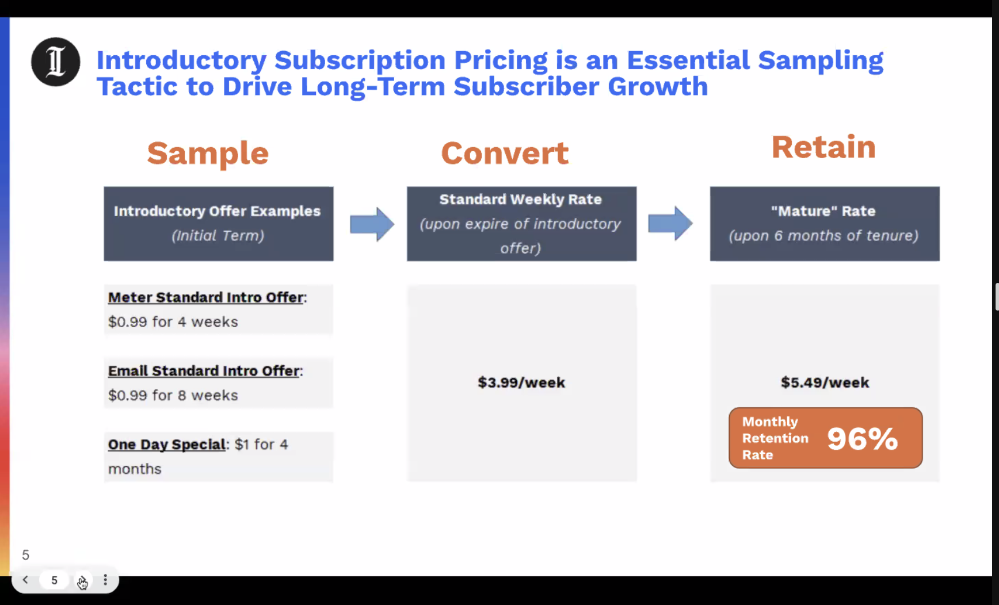
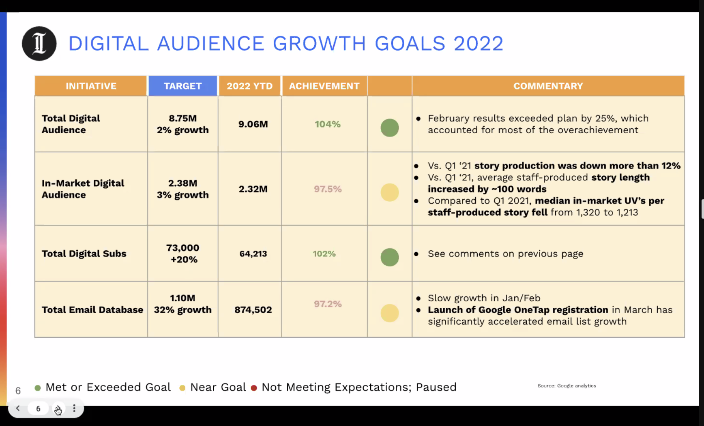
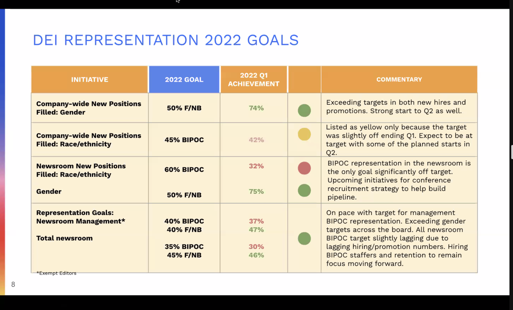

- [[Brian Waligorski]] #meeting/1:1
  collapsed:: true
	- [Notes](https://docs.google.com/document/d/1VLSF_MlqCmRK5eCEXow065F8UBKQGERIuw92__jS6dY/edit#heading=h.aa5br93en6j
		- Notes
		  Welcome back
		  Catch-ups:
		  KPI Scramble
		  Challenges:
		  Data Studio discoverability & governance
		  DBT dataset discoverability and usability
		  Data Catalog: Needs a plan
		  Have trial for Datahub
		  Upcoming conversation with atlan
		  Email Sending Service Switch
		  Bifurcating email sending systems for marketing from Salesforce and the newsroom through 
		  Next Steps for DEs
		  This week
		  Next week
		  Agile Backlog
		  Roadmap
		  Needs:
		  Priority & Clarity
		  E.g. anomaly detection means something needs to deprioritize this quarter
		  Prioritization and accountability
		  Multiple monthly major disruptions without major corrections
		  “We have more P1 bugs in production than ever”
		  “More bugs in production means that we’re working more quickly”
		  Product quality
		  Monitoring
		  Q2: Focus on process buy-in and process tools. Bonus points for substantial observability.
		  Passive monitoring metrics layer (Engineering)
		  Proposed set of rules for alerting (non-operations-changing, but maybe operational)
		  SLO Targets
		  When Mark Loomis is the Anamoly Bot: it gets triaged and addressed immediately.
		  Q3: Substantial observability and get out of mark’s DMS, get mark out of being the Anamoly Bot.
		- Action items
		  Brian Waligorski and David Riordan to come up with data catalog assessment plan. (How to choose between providers? What are the necessary features? Capabilities for long term alignment? Rollout and process change?)
- Company-wide [[2022/Q1]] [[Inquirer Strategy]] Update Meeting:
	- [20220418 All Company Strategy Meeting.mp3](../assets/20220418_All_Company_Strategy_Meeting_1650384202532_0.mp3)
	- Q1 Revenue Results
		- Big picture: Really good quarter
			- 1/2 M USD ahead
				- Driven by digital subs (50% 230k ahead of budget)
				- Classifieds
			- Digital subscribers really good (65k; 1k ahead of target)
	- Subscription pricing, introductory offers, and retention
		- 
		-
	- Q1 Audience Results and Commentary
		-
		- 
			-
		- In-market down; what we can control
		- Paywall vs Subscriber-only stories
			- [[dan hirshhorn]]: We are choosing to add more paying subscribers over the decision to have a lager top-line audience on the story. Come to have a very good appreciation of it
				- [[Sam Ruland]]:
				  > It’s about teaching people that this journalism takes time and money to produce and we need support to do that. The more things that get subscriber (and the longer we do this) the more we’ll show our readership that quality like that will be behind a paywall for a reason.
	- DEIA Goals
		- 
			-
	- Q1 [[operational excellence]] results
	- Intranet
	-