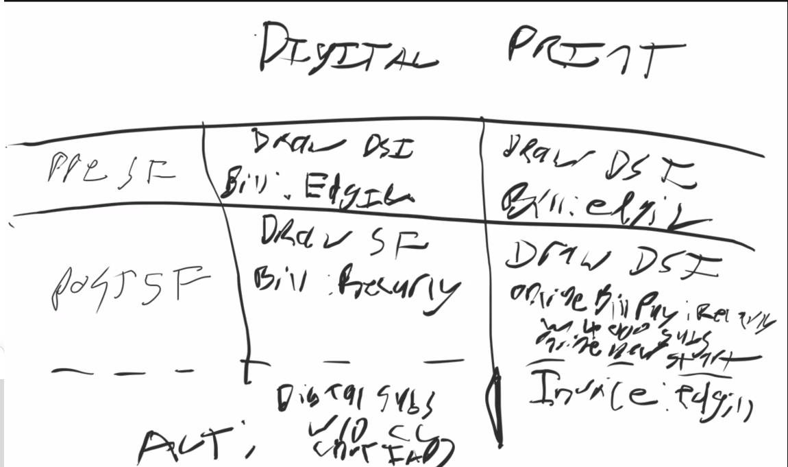

- dayforce
	- tie between dayforce and finance
		- sometimes breaks at depaartments and titles as a result
	- some willingness to do a trial to see what breaks
- Reporting systems
	- kronos
	- websked
	- arc
	- oracle
	- hermes provides logs
- [[Bill Tevis]]
- [[Jen]]
  collapsed:: true
	- [[Last Mile Project]] = continue out of dsi
	- focus exclusively on revenue reporting
	- Sunsetting DSI as the biller for digital subscriptions
		- This
	- Move to monthly digital billing:
		- marketing would love it
		- toan brings it up once a year
		- We don't monthly bill and want to draw every day and represent every day
		- 
- [[Unify Subscriber Data]]
	- Daily standup
		- David to update RAID every day after standup
	- ### [[Brian Waligorski]]: [[Full Replication]] for [[DSI]] on [[Unify Subscriber Data]]
		- >well, I think we’re at 100% capture for Salesforce. Should we just do a one-time dump of DSI tables to start?
		- > Ok, well if Mark/Kate/Jim/Jen could select from this list of tables the ones that would be necessary to do a DSI <-> SF comparison, then we could get somewhere
		- > i think one issue is that not every table has reliable updated_at timestamp column