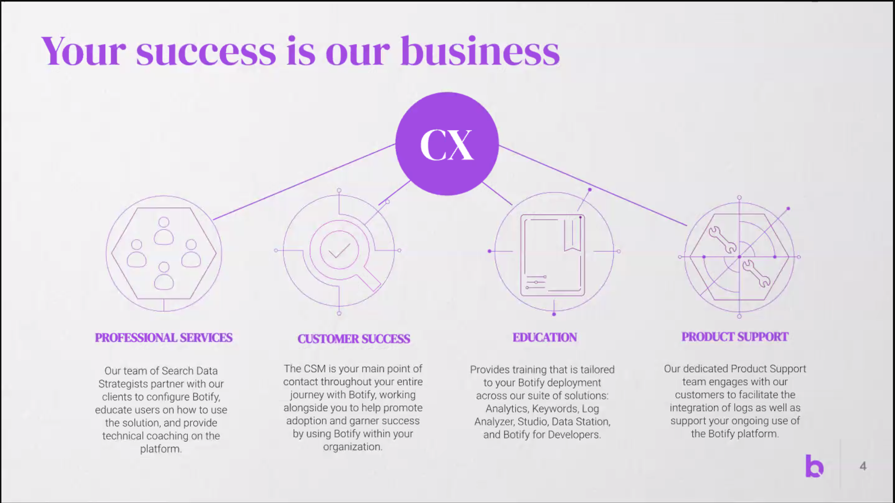
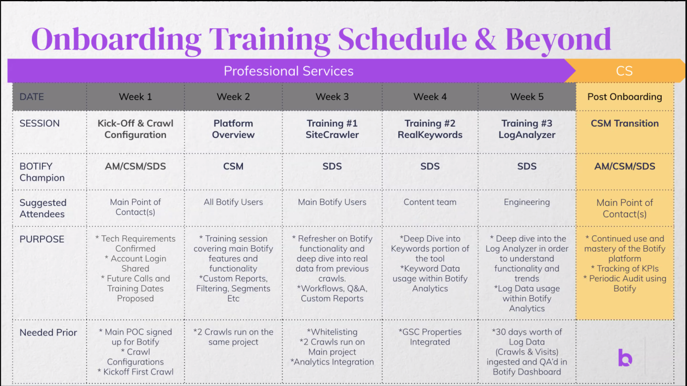

## Morning Journal
	- [Journal Template](((62a73923-0d4c-4e1c-a939-7fd90622dd86))) {{renderer :smartblock, Journaling Prompts, Insert Journal, true}}
## Day Planning
	- [Review](((62a89da8-158e-4a7a-a23d-f866fb3100a9))) your schedule for [Today](x-fantastical3://show?date=[[2022/07/15]])
		-
	- Review your schedule for [This Week](x-fantastical3://show?date=this week)
	- Review your Tasks
		- In [Omnifocus](omnifocus:///forecast)
		- In [[tasks]]
	- ### Day Thinking
		- #### Today I will work on
			-
		- #### Today I should work on
			-
		- #### Today I would like to work on (but will not)
			-
## Actual Work & Scratch
	- ## [[Botify]] Kickoff
	  collapsed:: true
		- SEO partner
		- Attendees:
			- Botify:
				- Vanessa Gallegos - Professional Services Team
				- Kathleen McGoldrick
			-
		- Meeting name:
		- Presenter: Vanessa Gallegos
		- Facilitator:
		- Notes:
			- Intend to kick off crawl during call
			- 
		- Key contacts:
			- Vanessa Gallegos - Customer Success Manager
			- Laura Giuliari - Senior Search Data Strategist
			- Kathleen Mcgoldrick - Account Manager - commercial contact
			- support group:
		- [[Botify]] Renewal: 2 years from now [[07/01/2024]]
		- Capabilities:
			- Botify Analytics
				- site crawler
					- 15m pages/month
				- log analyzer
					- daily runs
				- real keywords
				- engagement analytics
			- Botify Intelligence
				- Proactive alerts and recomendations
			- Botify Activation:
				- Automated remediation tasks
		- Onboarding
			- 30 days of data collection; need 30 days of log integration
			- 
			- CDN - Akamai. Get NGINX + CDN logs
		- Crawl:
		- Contact mechanisms: help@botify.com or support chat
		- NEED to filter Botify useragent out of our analytics.
			-
		- Action items:
		- Open issues:
	- ## [[Sophi]]
		- 3 products
			- site automation
				- content placement
					- Globe and Mail story selection is driven by an ML Model
						- e.g. in/out of canada, where in canada
					- Placement based on level of value to company based on scoring framework
				- Paywall tools
					- Content Paywall
					  id:: 62d1ac9d-db2f-4a0e-a222-4f544dd7da51
						- What gets hardwalled
					- Dynamic Paywall
					  id:: 62d1aca3-411f-4117-b819-95ef77e16ddf
						- User behavior scoring
						- register, subscribe, passthrough
			- Marketing's primary interest is paywall solutions
				- ((62d1ac9d-db2f-4a0e-a222-4f544dd7da51)) akin to our [[28-day hardwall]]
				- Been trying to figure out ((62d1aca3-411f-4117-b819-95ef77e16ddf))
			- [[Matt]]: What's the ((62d1aca3-411f-4117-b819-95ef77e16ddf)) configuration & administration like
				- Designed to be entirely automated; makes a decision, then newsroom has override
				- Content analysis when it's in CMS:
					- Score for ad value open vs. acquisition value
					-
	-
	-
## End-of-Day Wrapup
	- [EoD](((62a8f8a3-8e3a-4933-a94d-35cf93d8efe9))) {{renderer :smartblock, eod, Insert EoD, true}}