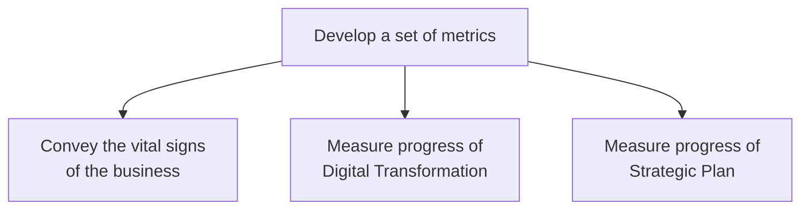
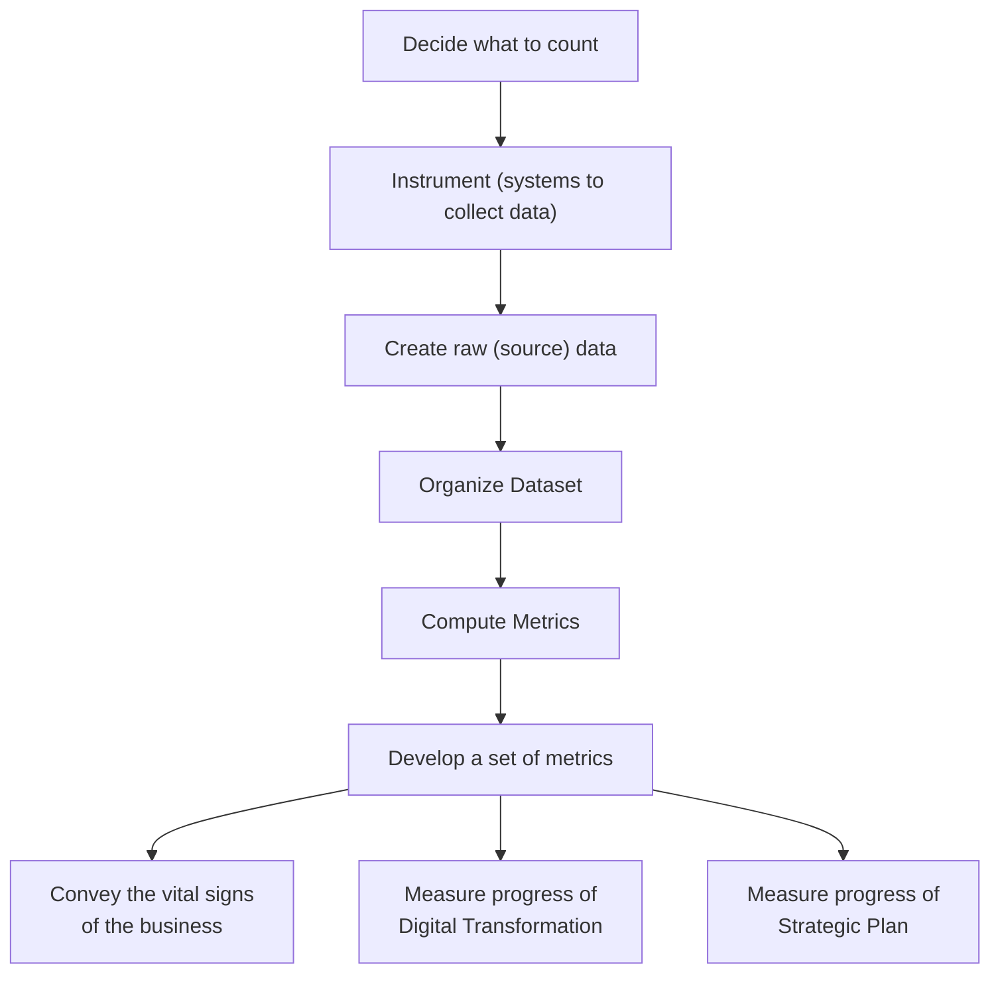

- ---
  tags: 
  ---
  Part of: [[Metrics That Matter]]
- # Why Do Metrics Matter?
  > The **mission** of the Metrics that Matter project is to **develop a set of metrics** that convey the **vital signs of the business** and measure the **progress of our digital transformation & strategic plan**.
  > 
  > As [[Lisa Hughes]] put it: every broadly shared datapoint should be accompanied by an explanation of why it matters, & should tie back to strategic business objectives.
  > -___[Metrics That Matter Project Summary](https://inquirer.atlassian.net/wiki/spaces/InqDS/pages/418120273/Metrics+that+Matter+project)__
  
  > What gets measured gets managed.
  > -__American Business Folk Wisdom often [misattributed to Peter Drucker](https://www.drucker.institute/thedx/measurement-myopia/)__ 
  
  > [What gets counted counts.](https://data-feminism.mitpress.mit.edu/pub/h1w0nbqp/release/3#n65z2v6y8ow)
  > [[Joni Seager]], Feminist Geographer
  > 
  > Even among those who are counted, they tend to be asked very narrow questions about their lives. “Women in poor countries seem to be asked about 6 times a day what kind of contraception they use,” Seager quipped in a lecture at the Boston Public Library. “But they are not asked about whether they have access to abortion. They are not asked about what sports they like to play.”
# Goals of Metrics that Matter
- **WHAT A:** 1. Measure the Goals of the Business
	- **WHY A0**
		- So we can measure the progress of our digital transformation
		- So we can measure the progress of our strategic plan
		- **WHY A1**
			- So we can have meaningful feedback to know if our actions are bringing us closer or further from our goals.
			- So we can have meaningful input about what actions we are taking as an organization are bringing us closer to our goals.
			- So we can form meaningful insights about why some actions are
		- **WHAT AB:** To do that we need to be able to compute metrics that can represent our progress toward our digital transformation and our strategic plan.
			- **WHY AB0**: So that we have agreed upon ways of measuring the kinds of changes that would represent meaningful progress
# Meditations on MTM

**WHY:** Measure the progress of our digital transformation and strategic plan

**Goals:**

**What it takes**

What happened before: focus on the final stages only: representation of data. But there couldn't be trust without alignment. How could you trust the "definitive" version of the data if highly trusted representations (i.e. the financial calculations, operational groups working on the exact same areas being measured) were completely different? Trusting in these required a way to reconcile these discrepancies. And if there are always discrepancies that need to be reconciled, there's too much cognative overhead to regularly dig deep enough to understand WHY those discrepancies might emerge iun the first pl,ace.

Meanwhile, what gets measured is what gets to count for the purposes of organizational change. Metrics are put in place to measure what we have already done. Where people believe a particular metric correlates to positive outcomes, activities correlated with those positive metric movements get more resources.

Yet not everything is counted. Not everything is countable, but that is far too often a justification to not inquire further, so that even when things that #incomplete ^nnvvws
- [x] #task Finish this thought paragraph [[Outcome Mapping for Metrics that Matter#^nnvvws]] ✅ 2022-01-26
  
  
  As an organization, the thigns that we count often are the elements taht modst relate to the financial health of our business. We have invested in valuable frameworks like "Customer Acquisition Funnels" to understand why it matters that we reach a large number of people, so that we can convert them into paying subscribers, and that thos epaying subscribers can underwrite the cost of oour journalism, with the promise that it is valuable to them.
  
  We don't have that for other elements that keep the health of our organization in check. That ensure that the business health is serving oiur mission goals.
  
  We have been missing on the trust elements since a "Metric" with different data is a different result. To align the metric in a trusted way we need to align the data too. That wasn't done before.