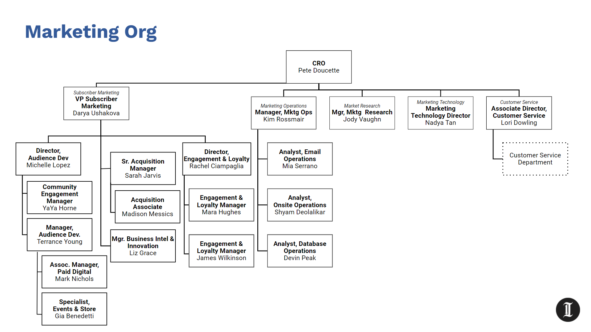

- ## Resources:
- [Department Confluence](https://inquirer.atlassian.net/wiki/spaces/MAR/overview)
- Weekly Meeting: Wednesdays - 1:30-3 - [agenda](https://docs.google.com/spreadsheets/d/1p37DccIHJMS97JWD1EtGGNQ29kEDkwS4Ih_kuCt-eBY/edit#gid=0)
- [2022 Marketing Roadmap](https://docs.google.com/spreadsheets/d/1d6Cn8yTeTRiPb5lOHTmlFAKyK9L0iiETBhPe5o4F0Bs/edit#gid=1383755865)
- ## Priorities
	- ### Beliefs
		- #### Objective:  
		  To create the holistic (digital & print) consumer marketing “machine” that sets high goals, then aggressively pursues and achieves them. We desire to be “Best in Class” for consumer marketing in the industry.
		- #### Our Hallmarks:
			- Operational Excellence
			- Key focus on speed
			- High quality customer experiences
			- Collaboration
			- Accountability
			- Empowering team members to make decisions
- ## Structure
- Org Chart (as of [[2022/04/13]])
	- 
- [[Pete Doucette]] - Chief Revenue Officer
	- [[Darya Ushakova]] - VP of Subscriber Marketing
		- [[Michelle Lopez]] - Director of Audience Development
			- [[YaYa Horne]] - Community Engagement Manager
			- [[Terrance Young]] -- Manager, Audience Development
			- [[Mark Nichols]] - Associate Manager, Paid Digital (inbound acquisition ads)
			- [[Gia Benedetti]] - Events & Store Specialist
		- [[Sarah Jarvis]] - Sr Acquisition Manager
-